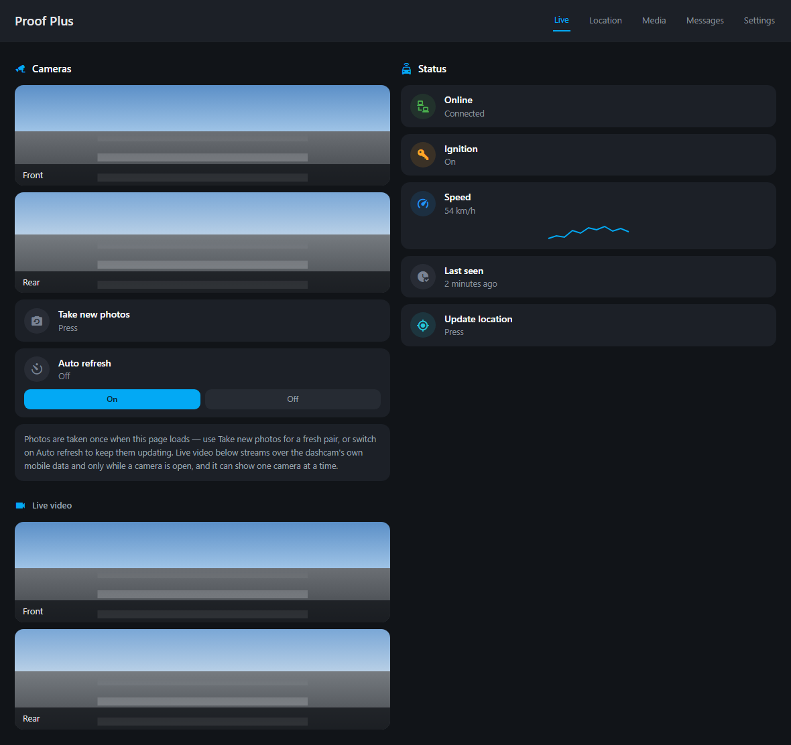
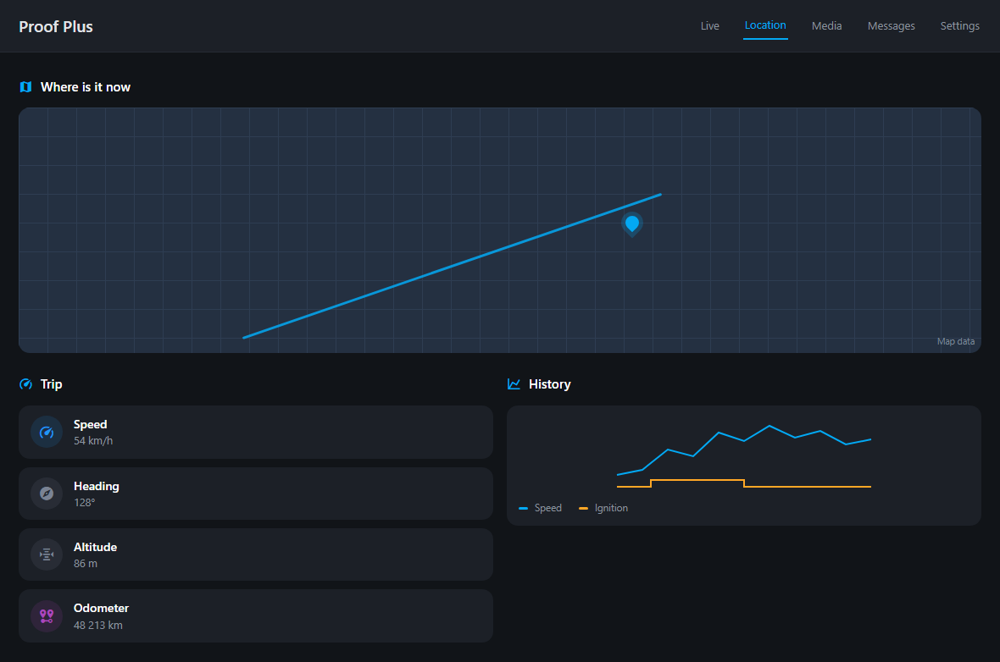
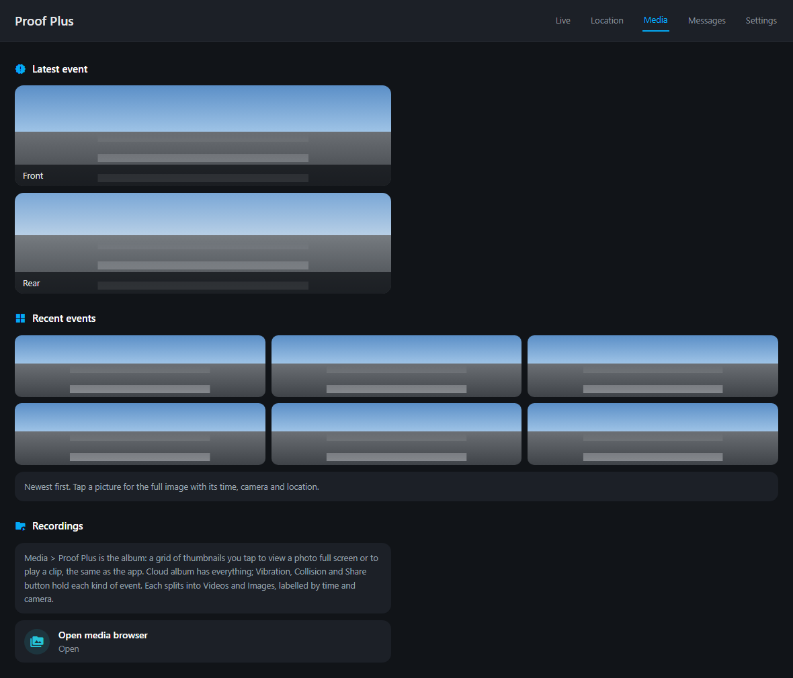
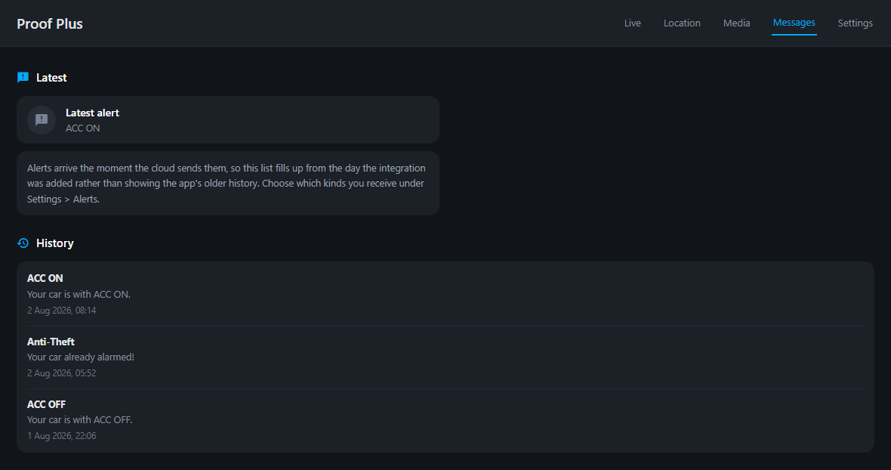
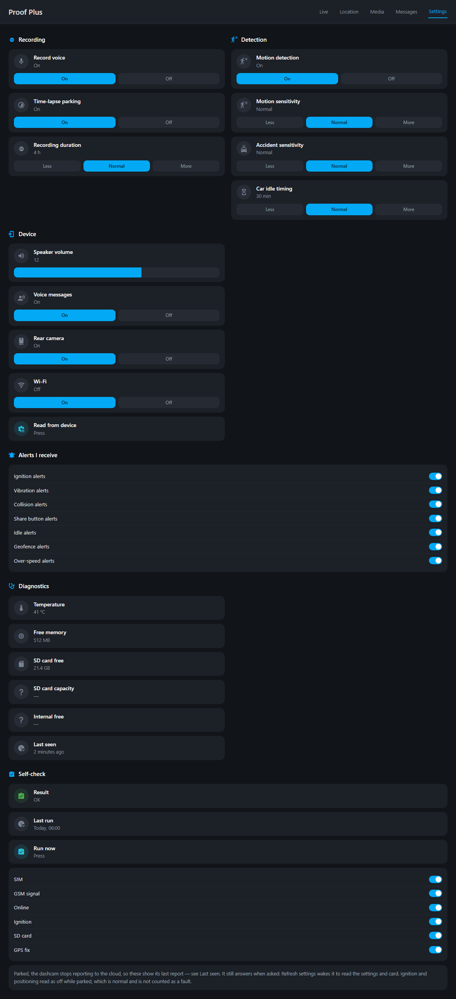

# Proof Plus — Home Assistant Integration

Custom integration for [Proof](https://2proof.co.il) 4G dashcams (IME/EDOG devices). It signs in
to the Proof cloud with the same account as the mobile app and exposes your dashcam's live
position and telemetry in Home Assistant.

Unlike the original YAML-based integration, this one uses the current **v5 cloud API**
(`app-p106.2proof.co.il`) and is fully configured from the UI (config flow, re-auth and options).

## Features

Per dashcam on your account:

| Entity | Description |
|---|---|
| `device_tracker` | Live GPS position (works with the map card and zones) |
| `binary_sensor` Online | Device connected to the cloud |
| `binary_sensor` Ignition | ACC / ignition state |
| `sensor` Speed | Current GPS speed (km/h) |
| `sensor` Total distance | Cumulative odometer reported by the device (km) |
| `sensor` Altitude / Heading | Last GPS fix details |
| `sensor` Device temperature | Internal device temperature (°C) |
| `sensor` GSM signal | Cellular signal strength (dBm) |
| `sensor` Last seen | Timestamp of the last report |
| `sensor` Last message | The newest alert the cloud pushed, with the recent ones as attributes |
| `image` Front/Rear snapshot | A still from each camera, taken on demand (with live view enabled) |

Redacted diagnostics are available from the integration page for troubleshooting.

### Optional video features (off by default)

Enable these under the integration's **Configure** options — nothing activates or streams
unless you turn it on:

- **Event snapshots** — adds an `image` entity per dashcam showing the most recent impact/event
  snapshot, with the event's GPS location. The image is only downloaded when Home Assistant
  renders it.
- **Media browser** — lists the recordings under **Media → Proof Plus**: the whole **Cloud album**
  plus **Impact events** and **Collisions**, each split into **Videos** and **Images** and labelled
  by time and camera. Nothing is downloaded; a recording is fetched from the cloud only when you
  open it, and each folder lists the newest few (5 by default, configurable).
- **Live view** — see the note under [Live view](#live-view) below.

## Installation

### HACS (recommended)

1. HACS → Integrations → ⋮ → **Custom repositories**
2. Add `https://github.com/niruse/Proof-Plus-Dashcam` as an **Integration**
3. Install **Proof Plus** and restart Home Assistant

### Manual

Copy `custom_components/proof_plus` into your Home Assistant `config/custom_components/` folder and
restart Home Assistant.

## Configuration

1. Settings → Devices & Services → **Add Integration** → search for **Proof Plus**
2. Enter the **phone number** and password you use in the Proof mobile app
   (email addresses are not accepted by the Proof login service)
3. Enter the verification code that is sent to that number by SMS
4. All dashcams on the account are added automatically

You only enter a code once — the session is then kept alive with the refresh token. If the
session is ever rejected, Home Assistant asks you to re-authenticate with a new code.

The polling interval (default 30 s — the same rate the device reports at) can be changed under
the integration's **Configure** options.

## Live view

Enable **Live view camera** in the options to add a live camera per dashcam. It is **off by default**
because the dashcam streams over its own cellular connection — so the session is opened only while
you are actually watching and is closed a few seconds after you stop.

The camera streams over **WebRTC** (this hardware does not support the RTMP path): the integration
opens the imclient WebSocket, sends an SDP offer to the device, exchanges ICE candidates and connects
through the Proof TURN relay, then bridges the media straight to the Home Assistant frontend as native WebRTC.
It works while the car is parked, **including audio** — the device's H.264 video and Opus audio are
forwarded to the browser untouched (no transcoding). Requires the `aiortc` package (installed
automatically).

Dashcams with a second camera get **Front camera** and **Rear camera** entities. The device can only
stream one camera at a time over a single session, so both entities share one connection and the
integration switches the device between them; opening the rear camera therefore changes what the
front camera shows until you switch back.

The **keep-alive** option controls how long the stream stays up after you stop watching (0 keeps it
running until closed, which uses cellular data continuously).

### Snapshots

A live card is blank until you open it, because the dashcam only streams while it is being watched.
So with live view **and** event snapshots enabled, each camera also gets a **snapshot** image: a
still taken the first time the card is shown and then kept, so the dashboard has a picture on it
without holding a stream open. Nothing refreshes on a timer by default — every capture wakes the
dashcam and spends its mobile data — so a **Refresh snapshots** button takes a new pair when you
want one.

If you would rather they keep themselves current, the **Auto refresh snapshots** switch does that
on a timer, every 15 minutes by default (change it under **Configure**). It is off to begin with and
remembers what you chose across restarts, so it never quietly starts spending mobile data on its
own. The switch's `interval_minutes` attribute shows the rate in use.

## Example dashboard

`examples/dashboard.json` is a complete dashboard laid out like the mobile app, with five tabs.

To use it: create a new dashboard, open its ⋮ menu → **Raw configuration editor**, paste the file
in, and replace `YOUR_DEVICE` with your dashcam's id (the number in your entity names, e.g.
`camera.1234567_live_view` → `1234567`).

> The pictures below are rendered from `examples/dashboard.json` itself, with invented placeholder
> readings — no real location, plate or account data.

### Live

Both cameras as stills plus the live streams, with status and a speed trend alongside.



### Location

Where the car is now, its recent track, and the trip figures.



### Media

The latest event from each camera, a grid of recent snapshots to tap, and a way into the album.



### Messages

The alert feed, newest first.



### Settings

Every dashcam setting, the account's alert toggles, diagnostics and the self-check panel.



## Messages

The app's **Messages** screen is not an API you can query — the cloud pushes each alert down a
WebSocket as it happens. The integration keeps that socket open and records what arrives in
`sensor.<device>_last_message`: the state is the newest alert's headline, and the recent ones
(up to 50) are kept in its `messages` attribute for the dashboard to list.

**The list starts empty and fills as alerts happen.** There is no history to fetch: the cloud only
queues alerts it has not delivered yet, releasing them in a burst at login and dropping them once
they are acknowledged. Everything older lives in a local database on the phone — clear the app's
storage and its Messages screen comes back empty too, so this is how the service works rather than
a limit of the integration.

Because that queue can still release a batch at login, each alert is stored under the id the cloud
assigns it, so a replay cannot duplicate the list.

Which alerts you get is controlled by the **Alerts** switches (ignition, vibration, collision,
share button, geofence, over-speed), the same account settings the app uses.

Every alert also fires a `proof_plus_message` event on the Home Assistant bus, so you can trigger
automations on one directly:

```yaml
trigger:
  - platform: event
    event_type: proof_plus_message
    event_data:
      type: coll
```

The socket carries no video and never wakes the dashcam — it is a link between Home Assistant and
the cloud. Because this is a push feed that can be quiet for hours, the sensor carries diagnostics
so a working-but-idle connection can be told from a broken one: `listening`, `connected_since`,
`session_id`, `frames_received`, `replies_received` and `alerts_received`. `replies_received`
counts answers from the server, so anything above zero means the socket is genuinely two-way.

## Self-check

A self-check mirrors the app's own screen: it judges the SIM, mobile signal, server connection,
ignition and GPS from what the dashcam last reported, and records the result with a timestamp
(`Self-check` and `Self-check last run`). It runs **daily** by default — change or disable that
under **Configure**, or press **Run self-check** at any time.

Signal is graded with the same bands the app uses (excellent down to −96 dBm, good to −104, then
bad), and the result carries `gsm_quality` and each item as attributes. Like the app, ignition and
positioning read as failing while the car is parked — but they do not count towards the overall
result, since a parked car is not a fault.

It reads only values that are polled anyway, so it costs nothing extra and does not wake the camera.

The SD-card and internal storage figures do need a live session, so they are read by **Refresh
settings** rather than on the timer — that is why the app's own self-check takes a while. Once read,
the values are remembered and the self-check reports the card too.

## Notes

- Cloud polling only; nothing is sent to third parties besides the official Proof cloud.
- If you change your Proof password, Home Assistant will prompt to re-authenticate.
- Devices added to your Proof account after setup appear after a Home Assistant restart
  (or by reloading the integration).
- The Proof v5 endpoints require a signed `x-sign` header; this integration generates it, so the
  system clock must be reasonably accurate (the signature embeds the current time).

### How it talks to the cloud

Established by analysing the mobile app's traffic and its (Hermes) JavaScript bundle:

- **Login:** `POST /api/app/v5/user/sendcode` `{"pn":"<phone>","type":"login","locale":"en_us"}`,
  then `POST /oauth/token` with `grant_type=app`, `client_id=app`, `client_secret=api1234`,
  `scope=SCOPE_READ`, `username`, `password` and `vcode`. `grant_type=refresh_token` renews it
  (the `scope` parameter is required, otherwise it fails with `invalid_scope`).
- **Request signing:** every `/api/app/v5/…` request carries an `x-sign` header equal to
  `base64( AES-128-CBC-PKCS7( "Proof|<epoch_ms>|<version>" ) )` with a fixed key and IV the app
  embeds. It encodes a timestamp, not the request body, so it must be regenerated per call and the
  client clock must be roughly correct. `/oauth/token` and `/user/sendcode` do not need it.
- **Signed endpoints:** `user/devices`, `user/profile`, `user/sysconfig`, and `cloud/files` (the
  media list — `type=shake` for impact clips, `type=coll` for collisions; the files themselves are
  then plain unsigned GETs from `fs-p106.2proof.co.il`).
- **WebSocket:** `ws://…:8282/imclient` authenticates with just the token
  (`[2,0,{"token":"…","info":{…}}]` → `[1,0,0,{"sid":"…"}]`, no signature). It carries WebRTC
  signalling to the device and generic RPC `[5,<seq>,["s.<method>",…]]`, so a live-video or command
  path may be reachable through it — a possible avenue for future features.
- The cloud appears to keep **one active token per account**, so signing in on the phone can
  invalidate Home Assistant's session and vice-versa.

## Credits

Inspired by [dimagoltsman/ha-proof-dashcam-integration](https://github.com/dimagoltsman/ha-proof-dashcam-integration),
which targeted the older Proof API. This integration was built by analyzing the current
Proof mobile app traffic (API v5).
